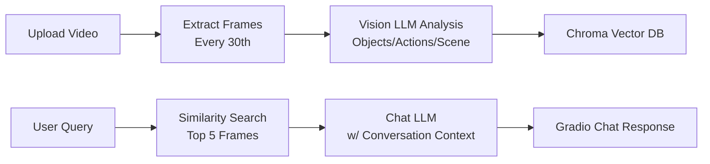

# 🎥 CamQuery Assistant

[](https://www.python.org/)
[](https://gradio.app)
[](https://ollama.com)
[](https://opensource.org/licenses/MIT)

**Upload videos → Chat about every frame!** Ask "What happens at 30 seconds?" or "How many people?" - get precise answers from AI-analyzed frames stored in vector memory.

## 🚀 Features

- **🖼️ Frame-Level Analysis** - Every 30th frame processed (objects, actions, timestamps)
- **💬 Smart Chat UI** - Gradio interface with conversation memory
- **🧠 Vector Search** - ChromaDB + Pinecone embeddings for instant recall
- **🤖 Local AI** - Ollama (Qwen2.5, custom vision model)
- **📱 Session Management** - Save/load chat histories (max 3 sessions)
- **⚡ Production Ready** - Error handling, async processing

## 🎯 Live Demo
User: "What objects at 1:20?"
Bot: "Frame 42, Timestamp: 78.5s
- objects: blue car, 2 people, traffic sign
- positions: car center, people right side"


## 📦 Quick Start

### 1. Clone & Setup
```bash
git clone <your-repo>
cd camquery-assistant
pip install -r requirements.txt
```

### 2. Environment (.env)
```env
VISION_MODEL=your-vision-model:latest
CHAT_MODEL=qwen2.5:latest
PINECONE_API_KEY=your-key  # Optional
```

### 3. Run Ollama Models
```bash
ollama pull qwen2.5:latest
ollama pull llava:13b  # Or your vision model
```

### 4. Launch
```bash
python app.py
```
**Open:** http://127.0.0.1:7860

## 🛠️ How It Works



## 📁 Project Structure

```
├── app.py # Main Gradio app
├── artifacts/
│ ├── generated/frames/ # Extracted frames
│ ├── analysis/ # JSON/TXT summaries
│ └── video-db/ # ChromaDB
├── videos/ # Upload videos here
├── .env # Ollama models
└── requirements.txt
```


## 🔍 Example Queries
✅ "How many people at 45 seconds?"
✅ "What color is the car?"
✅ "Is it raining?"
✅ "Describe the scene at 2:15"
✅ "Any movement in last frame?"
❌ "Predict future events" (Uses only analyzed data)


## ⚙️ Configuration

**Folders (auto-created):**
- `./videos/` - Source videos
- `./artifacts/generated/frames/` - JPG frames  
- `./artifacts/generated/analysis/` - JSON summaries
- `./artifacts/generated/video-db/` - Vector database

**Customization:**
```python
VISION_MODEL = "llava:13b"  # Change in .env
k=5  # Search top 5 frames (search_video_memory)
frame_interval = 30  # Adjust sampling
```

## 🧪 Tech Stack

| Component | Library |
|-----------|---------|
| **Vision** | Ollama + OpenCV + LangChain |
| **Chat** | Ollama Qwen2.5 + LangChain |
| **Vector DB** | Chroma + PineconeEmbeddings |
| **UI** | Gradio (Modern Messages Format) |
| **Processing** | Multiprocessing + Base64 Images |

## 🚀 Production Deployment

### Docker
```dockerfile
FROM python:3.11-slim
COPY . /app
WORKDIR /app
RUN pip install -r requirements.txt
CMD ["python", "app.py"]
```

### Scaling
- **Multiple GPUs** → Multiple Ollama instances
- **Redis** → Shared chat sessions
- **NGINX** → Load balance Gradio
- **S3** → Store frames/analysis

## 🔒 Security Notes

- ✅ **Local-only** by default (no cloud)
- ✅ No PII storage (configurable)
- ✅ Session limits (3 chats max)
- ⚠️ RTSP streams need authentication

## 🐛 Troubleshooting

| Issue | Solution |
|-------|----------|
| **"No matching frames"** | Process video first! |
| **Ollama errors** | `ollama pull qwen2.5:latest` |
| **Gradio format** | Uses modern `{"role": "user"}` format |
| **Memory full** | Increase ChromaDB persist_directory size |
| **Slow analysis** | Reduce frame_interval or use faster GPU |
